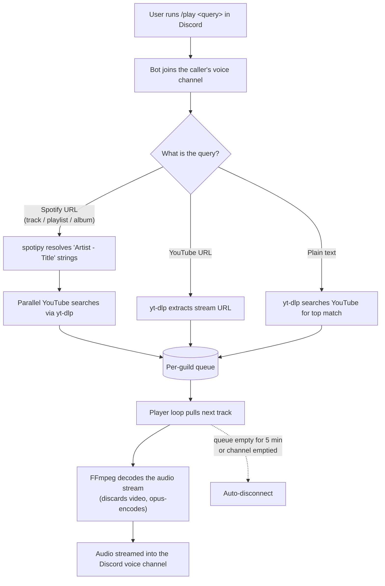

# coach who plays

A small Discord music bot. Slash-command only, written in Python with
[discord.py](https://github.com/Rapptz/discord.py) and
[yt-dlp](https://github.com/yt-dlp/yt-dlp). Joins your voice channel, plays
audio from YouTube/SoundCloud links or a free-text search, and manages a
per-guild queue.

## Features

- `/play <url or search>` — joins the caller's voice channel and queues a song.
  Free-text queries are searched on YouTube by default.
- `/queue` — shows the current track and the next ten upcoming.
- `/nowplaying` — current song with link and requester.
- `/skip` — skips the current track.
- `/stop` — clears the queue and disconnects.
- Smart URL handling — `youtube.com/watch?v=X&list=Y` plays just video X
  (like YouTube itself does); `youtube.com/playlist?list=Y` enqueues the whole
  playlist.
- Spotify link support — paste a Spotify track, playlist, or album URL and
  the bot resolves the metadata via the Spotify API, then plays the matching
  audio from YouTube. Requires free Spotify API credentials (see below).
- Auto-leave — disconnects after 5 minutes of idle queue, or immediately when
  every non-bot member leaves the voice channel.
- Per-guild queue isolation; safe cog reloads.

## How it works



## Requirements

- Python 3.11+
- [uv](https://docs.astral.sh/uv/) for dependency management
- **FFmpeg** on your `PATH` (audio decoding)
- **libopus** (voice encoding — discord.py needs it at runtime)
- A Discord application + bot token

### Installing the native dependencies

| Platform | Command |
|---|---|
| macOS (Homebrew) | `brew install ffmpeg opus` |
| Ubuntu / Debian | `sudo apt install ffmpeg libopus0` |
| Arch | `sudo pacman -S ffmpeg opus` |
| Windows (winget) | `winget install Gyan.FFmpeg` (libopus ships with discord.py wheels on Windows) |

Verify FFmpeg with `ffmpeg -version` in the same shell you'll run the bot from.

## Setup

```bash
# 1. Clone
git clone https://github.com/steven-ngle/coach-who-plays.git
cd coach-who-plays

# 2. Create the virtual environment and install Python deps
uv venv
uv pip install -r requirements.txt

# 3. Configure your token
cp .env.example .env
# then edit .env and paste your bot token
```

### Creating the Discord bot

1. Go to <https://discord.com/developers/applications> → **New Application**.
2. **Bot** tab → reveal the token and paste it into `.env` as `DISCORD_TOKEN`.
3. **OAuth2 → URL Generator** → scopes `bot` and `applications.commands`.
4. Bot permissions: View Channels, Send Messages, Embed Links, Connect, Speak,
   Use Voice Activity.
5. Open the generated URL and authorize the bot in your server.

### Enabling Spotify links (optional)

Spotify's Web API doesn't stream audio, but it does hand out track/artist
metadata. The bot uses that metadata as a YouTube search — so pasting a
Spotify track, playlist, or album URL "just works" for playback.

There are **two levels** of Spotify support depending on what URLs you want
to handle:

**Level 1 — Client Credentials (5 minutes)**
Works for individual tracks, albums, and user-created playlists. Does **not**
work for Spotify-owned editorial or algorithmic playlists (Today's Top Hits,
Discover Weekly, RapCaviar, etc.) — those were locked down for Client
Credentials in November 2024.

1. Go to <https://developer.spotify.com/dashboard> and log in.
2. **Create app** — any name. For "Which API/SDKs", check **only Web API**.
   Set the Redirect URI to `http://127.0.0.1:8888/callback` (Spotify no
   longer accepts `localhost`; it must be a loopback IP with an explicit
   port). Accept the ToS.
3. Copy the **Client ID** and **Client Secret** from the app's settings.
4. Paste them into `.env`:
   ```
   SPOTIFY_CLIENT_ID=...
   SPOTIFY_CLIENT_SECRET=...
   ```
5. Restart the bot.

**Level 2 — Authorization Code (adds editorial playlists)**
If you also want Today's Top Hits, Discover Weekly, and the other
Spotify-curated playlists to resolve, do the OAuth login once:

1. Add the redirect URI to `.env` (it must match what you registered on
   the Spotify dashboard):
   ```
   SPOTIFY_REDIRECT_URI=http://127.0.0.1:8888/callback
   ```
2. Run the login helper:
   ```bash
   uv run spotify_login.py
   ```
   Your browser opens Spotify's auth page. Approve, and a refresh token gets
   cached to `.spotify-cache` (git-ignored). You won't need to do this again
   unless you delete the cache or revoke access in your Spotify account.
3. Restart the bot. The startup log shows
   `Spotify: using OAuth (cached token) — full API access`.

Without any of these variables, Spotify URLs are refused politely. YouTube
links and search queries always work regardless.

### Running

```bash
uv run bot.py
```

You should see:

```
Loaded libopus from /opt/homebrew/opt/opus/lib/libopus.dylib
Loaded extension: cogs.music
Synced N command(s) globally
Logged in as coach who plays#1234 (id=...)
```

Global slash-command sync can take up to an hour to appear in Discord. While
developing, set `DEV_GUILD_ID` in `.env` to your test server's ID for instant
sync (enable Developer Mode in Discord and right-click the server name to copy
the ID).

## Commands

| Command | Description |
|---|---|
| `/play <query>` | URL or search. Joins your voice channel. |
| `/queue` | Show what's playing and the next ten tracks. |
| `/nowplaying` | Title, duration, link, requester. |
| `/skip` | Skip the current track. |
| `/pause` | Pause the current track. |
| `/resume` | Resume a paused track. |
| `/loop <off\|track\|queue>` | Set loop mode. `track` replays the current song; `queue` cycles the whole list. |
| `/stop` | Stop, clear queue, disconnect. |

## Configuration

Environment variables loaded from `.env`:

| Variable | Required | Description |
|---|---|---|
| `DISCORD_TOKEN` | yes | Bot token from the Developer Portal. |
| `DEV_GUILD_ID` | no | If set, sync commands to just this guild (instant). |
| `SPOTIFY_CLIENT_ID` | no | Enables Spotify link resolution. |
| `SPOTIFY_CLIENT_SECRET` | no | Paired with `SPOTIFY_CLIENT_ID`. |
| `SPOTIFY_REDIRECT_URI` | no | If set, enables OAuth for editorial playlists. Run `spotify_login.py` once after setting. |

Tunables live as constants at the top of `cogs/music.py`:

- `IDLE_TIMEOUT_SECONDS` — auto-leave timeout (default 300s).
- `YTDL_OPTIONS` / `FFMPEG_OPTIONS` — extractor and audio-pipeline tuning.

## License

Released under the [MIT License](LICENSE).

## Disclaimer

This is a personal / educational project. It uses `yt-dlp` and the Spotify
Web API in ways that may conflict with the Terms of Service of YouTube and
Spotify. Use at your own risk. Do not run this as a public service, do not
monetize it, and do not distribute audio you don't have the rights to. The
maintainer provides no warranty and accepts no responsibility for how the
bot is used or the terms it may violate.